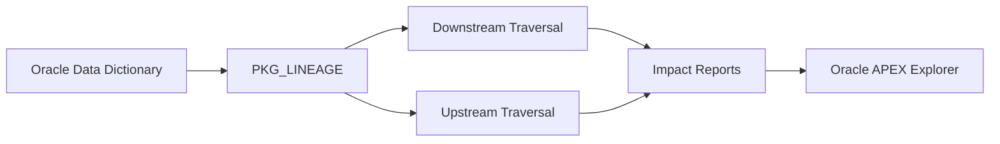
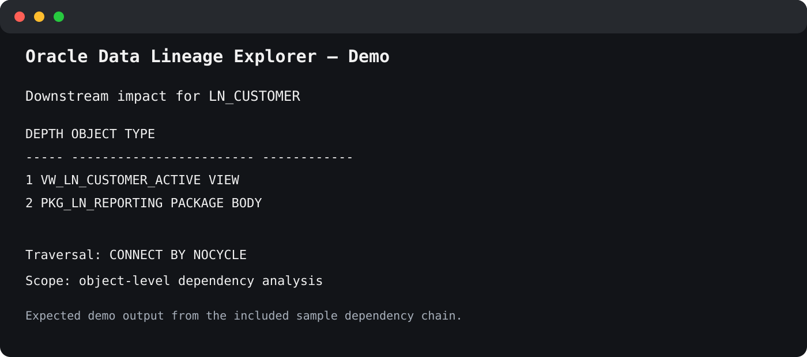
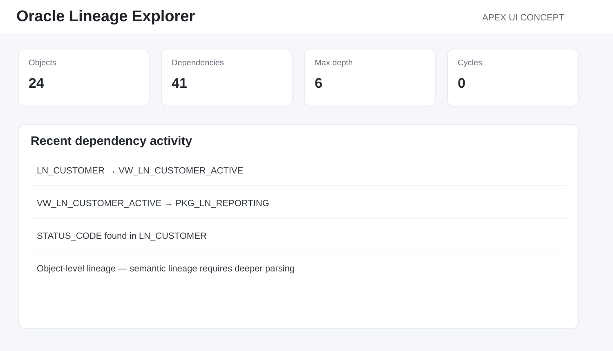

# Oracle Data Lineage & Impact Analysis Explorer

<p align="center">
  
  
  
  
</p>

> **Oracle metadata exploration for upstream/downstream dependency analysis.**

## Architecture



<p align="center"></p>

A metadata-driven Oracle project that explores object dependencies and supports basic impact analysis using the Oracle data dictionary.

## Oracle metadata used

```text
USER_DEPENDENCIES
USER_OBJECTS
USER_TAB_COLUMNS
USER_VIEWS
USER_SOURCE
```

`ALL_*` or `DBA_*` views can be substituted when cross-schema visibility is required and appropriate privileges are available.

## Demo dependency chain

```text
LN_CUSTOMER
    |
    v
VW_LN_CUSTOMER_ACTIVE
    |
    v
PKG_LN_REPORTING
```

## Installation

```sql
@install.sql
```

## Downstream impact analysis

```sql
select *
from table(
    pkg_lineage.downstream(
        p_object_name => 'LN_CUSTOMER',
        p_max_depth   => 10
    )
);
```

## Upstream dependency analysis

```sql
select *
from table(
    pkg_lineage.upstream(
        p_object_name => 'PKG_LN_REPORTING',
        p_max_depth   => 10
    )
);
```

## Column search

```sql
select *
from user_tab_columns
where upper(column_name) = upper('STATUS_CODE')
order by table_name;
```

## Recursive traversal strategy

Oracle dependencies form a graph rather than a simple tree. The package uses hierarchical queries with `CONNECT BY NOCYCLE` to avoid infinite loops.

The project records dependency depth, source object, dependent object, object type and dependency type.

## Important limitation

`USER_DEPENDENCIES` provides object-level dependencies. It does **not** provide complete column-level lineage.

Knowing that a view depends on a table does not automatically prove how each output column derives from each input column.

True column-level lineage usually requires SQL parsing, PL/SQL source analysis, ETL metadata, ODI mappings, data catalog metadata, or custom annotations.

This limitation is intentional and documented because impact-analysis tools should distinguish structural dependency from semantic lineage.

## APEX UI concept

The following is a **design concept**, not a screenshot of a deployed APEX application.

<p align="center"></p>

See [apex/README.md](apex/README.md) for the page-by-page build guide.

## Design & Engineering Decisions

### Use the Oracle data dictionary as the primary metadata source
The project relies on Oracle-maintained metadata instead of maintaining a second manual dependency catalog.

### Distinguish dependency analysis from full semantic lineage
The project deliberately avoids claiming that `USER_DEPENDENCIES` provides complete column-level lineage.

### Model dependencies as a graph
Objects can have multiple parents, multiple children and cycles, so the package uses cycle-safe hierarchical traversal.

### Provide both downstream and upstream traversal
Downstream answers “what may be affected?” while upstream answers “what does this object depend on?”

### Limit traversal depth
`p_max_depth` protects interactive usage from unexpectedly large dependency graphs.

### Return SQL-visible collection types
Pipelined SQL collection types make the API easy to consume from SQL, APEX, REST services and other PL/SQL code.

### Keep source-code analysis separate
The project exposes source metadata but does not pretend to fully parse dynamic SQL or external ETL logic.

## Key Takeaways

- Oracle metadata can support useful impact analysis without a separate catalog.
- Object dependency and column-level lineage are different concepts.
- Dependency structures should be treated as graphs.
- Both upstream and downstream navigation are important.
- Metadata tooling should state blind spots clearly.

## Skills demonstrated

Oracle Database · SQL · PL/SQL · Data Dictionary · Hierarchical Queries · Pipelined Functions · Data Lineage · Impact Analysis · Oracle APEX

## Possible extensions

- cross-schema analysis with `ALL_DEPENDENCIES`;
- graph visualization in APEX;
- source-code keyword analysis;
- column-level lineage heuristics;
- dependency snapshot history;
- Git-based DDL comparison;
- ORDS REST API.

## LinkedIn

A LinkedIn-ready project description is available in [docs/linkedin-project.md](docs/linkedin-project.md).

## License

MIT License. See [LICENSE](LICENSE).
